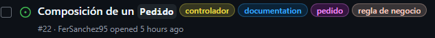

# 🚴‍♂️ DeliExpress
  
  ### Proyecto final de Taller de Programación 2
  
  ---
  
  ## 👨‍💻 Integrantes
  
  - Federico Wainstein  
  - Fernando Sánchez  
  - Sebastián Rosenfeld  
  - Mateo Alonso De Armio  
  
  ---
  
  ## ✅ Requisitos mínimos
  
  - Mínimo de **5 colecciones**.
  - **Credenciales individuales** por integrante.
  - Para cada colección, debe haber al menos **4 endpoints**:  
    - Alta (POST)  
    - Baja (DELETE)  
    - Modificación (PUT/PATCH)  
    - Lectura (GET)
  
  ---
  
  ## 📜 Reglas de negocio
  
  La lógica y las reglas de negocio aplicadas sobre este proyecto se encuentran detalladas en el siguiente documento:
  
  ➡️ [📘 Reglas de negocio](docs/reglas_de_negocio.md)
  
  ---
  
  ## 🧱 Estructura y relaciones entre entidades
  
  La estructura de las entidades y las relaciones que existen entre ellas se encuentran detalladas en el siguiente documento:
  
  ➡️ [🗂️ Estructura y relaciones entre entidades](docs/estructura_y_relaciones_entre_entidades.md)
  
  ---
  
  ## ⚙️ Cómo utilizar el proyecto
  
  Después de clonar el repositorio, se debe crear un archivo `.env` el cual tendra la variable de entorno correspondiente al puerto que utilizará _Express_  para levantar el servidor.

  ### 📄 Plantilla para archivo .env
    ```
    PORT=3000
    MONGO_URI= //Tus credenciales de conexion a al BD
    ```

  Como el proyecto requiere que cada uno de los participantes utilice sus propias credenciales en la base de datos (MongoDB) se debe agregar el archivo `.env` al `.gitignore`. Esto evitará que las credenciales se sobreescriban cada vez que un integrante realiza un _push_ al repositorio.

  ---
  
  ### 🏃‍♂️‍➡️ Correr la aplicación
  Instalá las dependencias necesarias con el siguiente comando:
  
  ```bash
  npm install
  ```
  
  Para ejecutar la aplicación en modo desarrollo (utilizando `nodemon`):
  
  ```bash
  npm run dev
  ```
  
  Para ejecutar el servidor utilizando unicamente Node:
  
  ```bash
  npm start
  ```
  ---

  ### 📚 Ramas del proyecto
  El proyecto tiene como base dos ramas `main` y `develop`. En `main` se subiran toso los cambios **permanentes y funcionales** generados en el desaroolo del proyecto. En cambio, en `develop` se van a subir todos los cambios realizados por los integrantes. Esta rama es el nexo de los **cambios individuales** realizados en cada rama personal, por esta razón es que se utilizará para probar las funcionalidades agregadas por los integrantes del equipo antes de poder subirlas a `main`. 
  
  **Los integrantes deben generar su propia rama del proyecto en la cual realizarán lo propuesto en cada _issue_.**

  Una vez que un integrante haya generado un cambio funcional en su rama debrá hacer un _merge_ sobre `develop` para probar el conjunto de funcionalides agregadas por el resto de los integrantes. Si todo funciona correctamente será posible hacer un _merge_ desde `develop` a `main`.

  ---
  
  ## 🛠️ Agregar Issues
  
  Para agregar nuevos issues al proyecto, es necesario utilizar los **labels** correspondientes a:
  
  - La **entidad** sobre la que se está trabajando.
  - El **tipo de archivo** afectado (por ejemplo: controlador, modelo, router).
  - Si corresponde a una **regla de negocio**.
  - Si requiere ser **documentado**.
  
  ### 📌 Ejemplo:
  
  Si se quiere agregar una nueva regla de negocio que afecte el funcionamiento de la entidad `Pedido`, los labels sugeridos serían:
  
  - `pedido`  
  - `controlador`  
  - `regla de negocio`  
  - `documentación`
  
  
    
